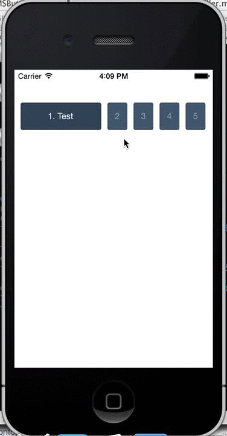

MSButtonPanel
=============

MSButtonPanel is a UIView subclass that holds a row of buttons. Each button expands or collapses dynamically on selection.
Here's a short GIF showing it in action: 

All developers need to do to initialize it is to pass in an array of strings to be displayed when each respective button is selected (as well as optional parameters for background colors, text colors, and fonts). 
 
Then, to set actions on each button, developers have two options. The first is to set the button panel's delegate and implement the delegate method `- (void)buttonPanelDidSelectButtonWithIndex:(NSInteger)index`, and the other is to pass a target and selectors through in the alternative instance method `- (instancetype)initWithButtonTitles:(NSArray *)buttonTitles target:(id)target andSelectors:(NSArray *)selectors`. Example of each technique is displayed below.

Delegate method:

    MSButtonPanel *buttonPanel = [[MSButtonPanel alloc] initWithButtonTitles:@[@"Test", @"Test", @"Test", @"Test", @"Test"]];
    buttonPanel.delegate = self;
    [self.view addSubview:buttonPanel];

Then implement the delegate method to handle selection based on the selected index.
    
Target/selector method:

    MSButtonPanel *buttonPanel = [[MSButtonPanel alloc] initWithButtonTitles:@[@"Test", @"Test", @"Test", @"Test", @"Test"] target:self andSelectors:@[[NSValue valueWithPointer:@selector(test1)], [NSValue valueWithPointer:@selector(test2)], [NSValue valueWithPointer:@selector(test3)], [NSValue valueWithPointer:@selector(test4)], [NSValue valueWithPointer:@selector(test5)]]];
    [self.view addSubview:buttonPanel];
    
Note that selectors passed through an array must be passed as NSValues.
